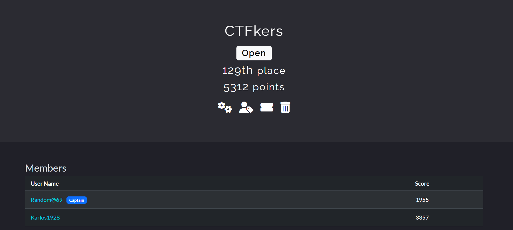
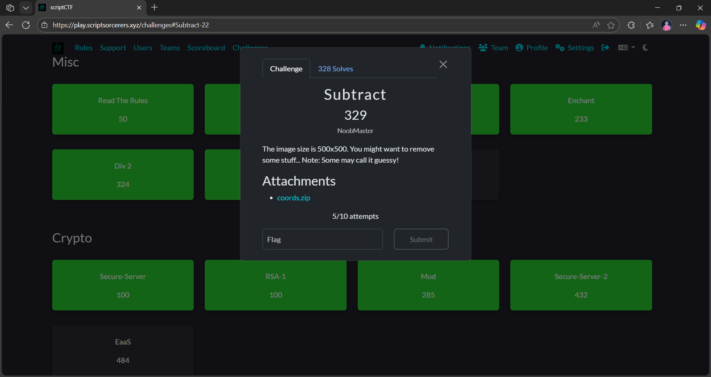
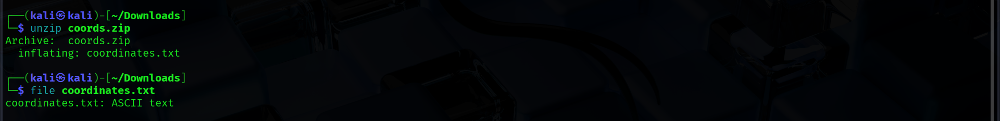
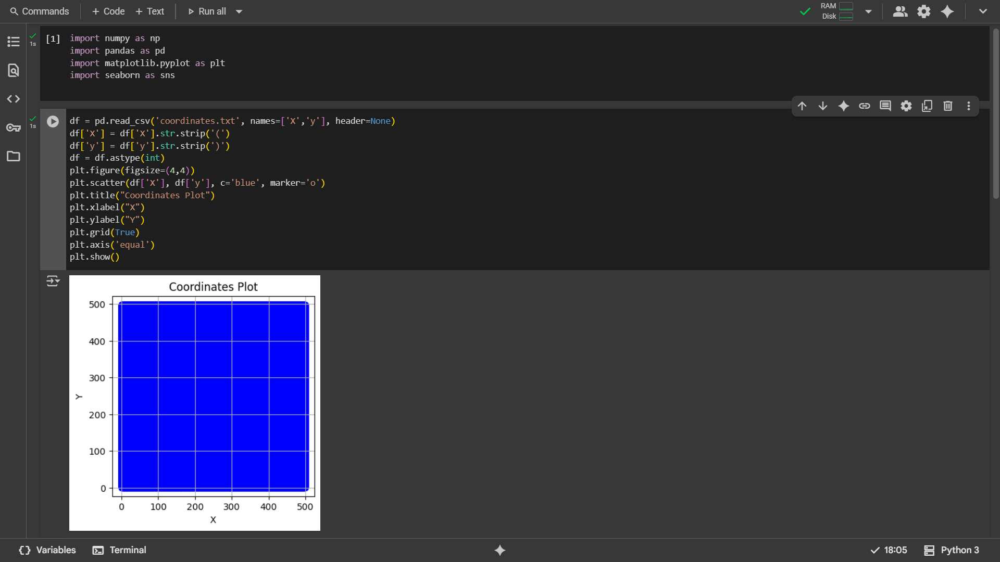
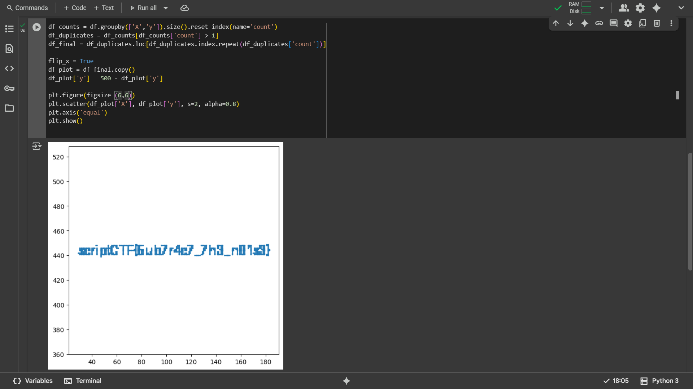
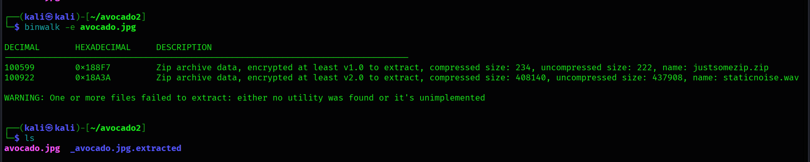
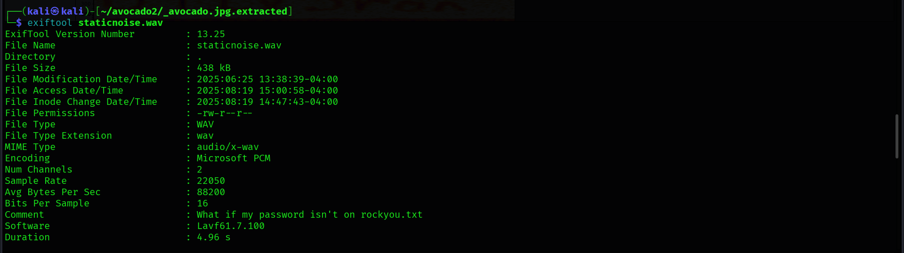
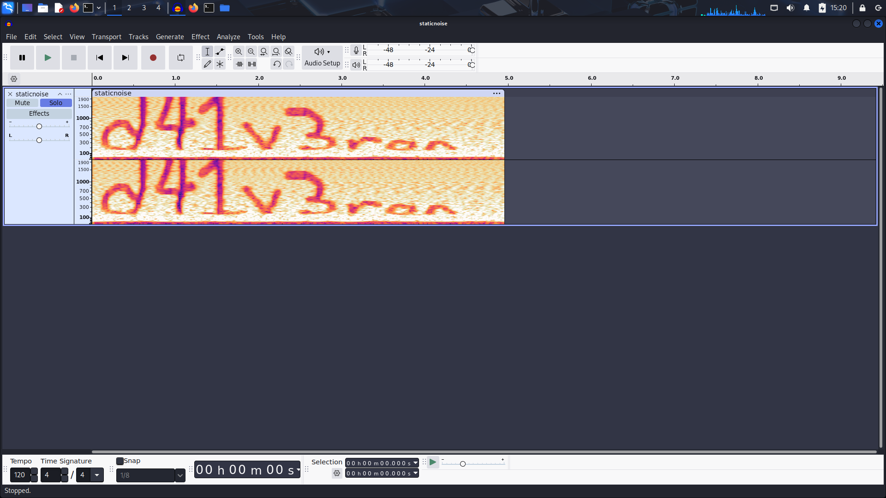
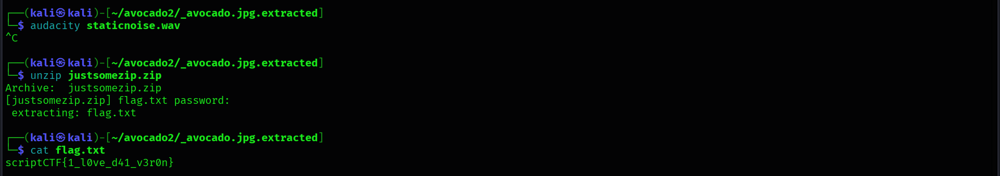

# Writeups
## Information

### Team Information: 

### CTFkers

Name, CTFTime, Discord
1. Priyanshu Mishra: Random@69, random_6905_60723
2. Yug Bargaway: Karlos1928, gameryug6329

### Problem Description

This has a file coords.zip opening it revealed a dataset of coordinates.

---

### Exploration / Approach
Unzipping the data revealed coordinates.txt which contained data of coordinates.

- I opened the dataset in colab and plotted a scatterplot and it came out like this.

- The whole square area of side 500 was filled.
- I checked its shape, it came out to be (250573, 2). This caused me the doubt and I tried to remove the unique coordinates and only keep the duplicates and when I plotted the data I got the following figure

Bingo!! The strategy worked and the flag was extracted.

---

### Final flag
scriptCTF{5ub7r4c7_7h3_n01z3}

---

## Just Some Avocado - Forensics 

### Problem Description
The problem had a avocado.jpg file attached and no other hint given

---

### Exploration / Approach
- As I had nothing other than the jpg file. I tried the basic test with file, strings, exiftool, binwalk, etc.
- Checking with binwalk gave the hint of presence of two files viz. justsomezip.zip and staticnoise.wav

- So I pulled both the files out using binwalk -e avocado.jpg
- It created a _avocado.jpg.extracted directory with a file 188F7.zip in it.
- Trying to unzip it prompted me for a password for justsomezip.zip
- As I had no other clue for password,therefore I tried to search for a password attack and found about dictionary attack using rockyou.txt wordlist. I used the following command 
1. zip2john 188F7.zip > zip.hash
2. john --wordlist=/usr/share/wordlists/rockyou.txt zip.hash
- This gave me the password impassive3428
- Opening it and trying to unzipping it result in a new prompt for flag.txt
- checked the staticnoise.wav using exiftool and its description was a mock of like didn't we got the password of flag.txt in rockyou.txt

- We opened the staticnoise.wav in audacity to check and got some text written there d41v3ron

- Used it to unzip justsomezip.zip and it opened and gave the flag.txt and read the content using cat.

---

### Final flag
scriptCTF{1_l0ve_d41_v3r0n}

---

## Index - Pwn 

### Introduction / Context
I literally hand you the flag, just exploit it already!
A file index.zip was attached.

---

### Problem Description
Here, an index.zip file was given. When unzipped, it revealed an executable file index.

---

### Exploration / Approach
- As it was an executable file, I used objdump to get the assembly of the file.  
- I saw that it has some functions defined like store_flag, read_data, print_flag, exit.  
- In main function, I saw that there was a switch case where, the input was being compared to 1,2,3,4 and if it is greater than 4, it was being compared to 0x539(i.e., 1337), that was a sign of hidden option thing.  
- When inputed 1337, it is reading from the address 0x40a0 and storing in f.  
- Now I also saw that in read_data, it is reading from a nums array at 0x4060 address. I also saw that flag is at 0x40a0  
- When calculated the index (0x40a0 - 0x4060)/8 = 8. That means it is storing the flag at 8th index of nums array.  
- Then I again ran the program and also created a dummy flag.txt to check.  
- I chose option 2 to read_data and inputed 8th index and got the flag.  
- Now I ran the instance and did the same process and got the flag.

---

### Final flag
scriptCTF{4rr4y_00B_unl0ck3d}

---